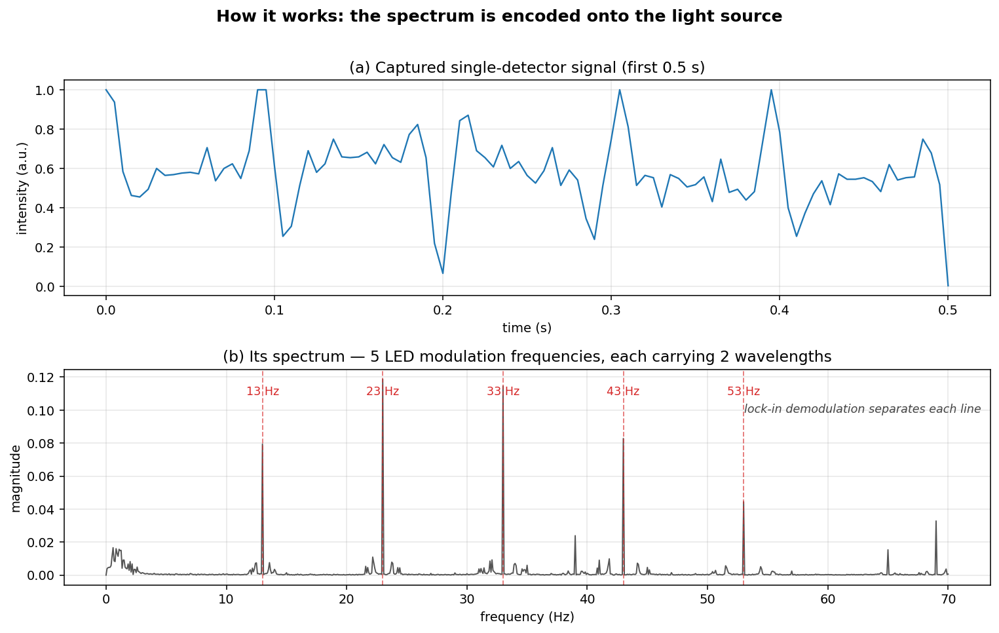
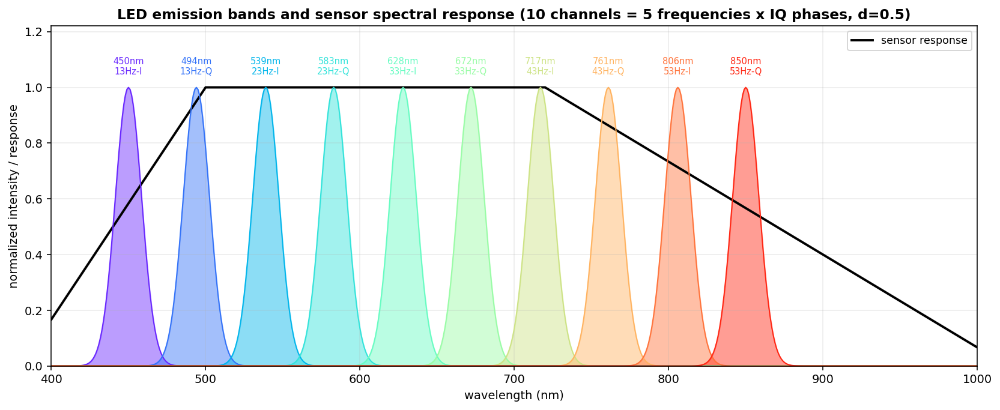
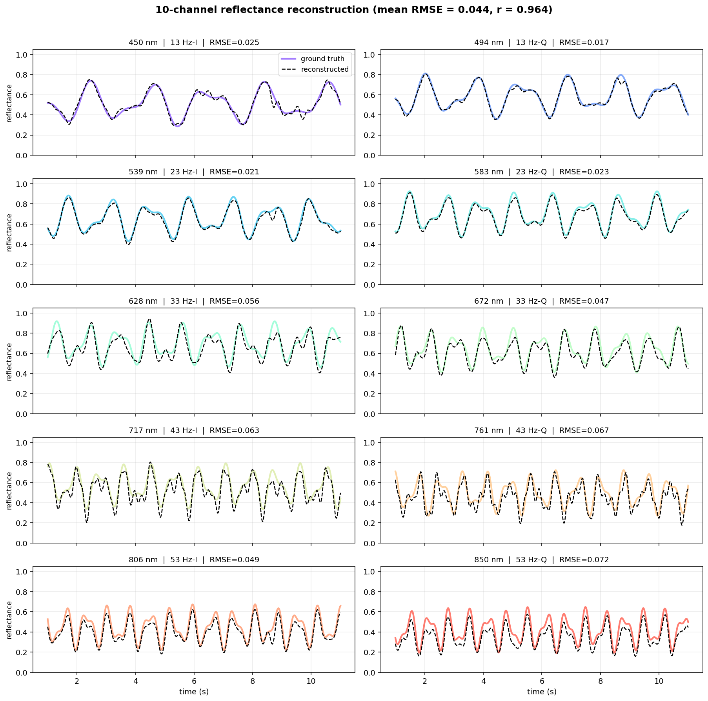
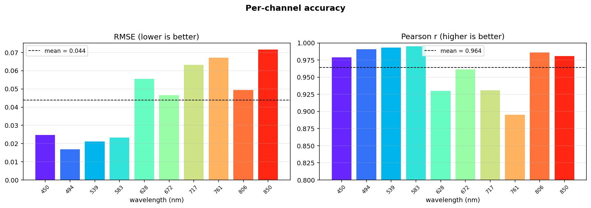

# Multi-Wavelength LED Phase-Encoded Reflectance Sensing for Multispectral Imaging

[](https://github.com/weiCHENyongjin/ChromaCode/actions/workflows/ci.yml)

> **Language**: **English** | [中文](README.zh-CN.md)

**Version**: v1  **Date**: 2026-06-05
**Status**: Phase-1 complete — single-pixel proof of concept, parameters validated

A simple, low-cost approach to multispectral imaging: **encode the light source instead of
splitting the light**. Multiple single-wavelength LEDs are PWM-modulated at different
frequencies and orthogonal phases; a single ordinary photodetector captures the superimposed
reflected signal, and **IQ quadrature lock-in detection** separates the time-varying reflectance
of each wavelength. No prisms, gratings, filter wheels, or tunable filters are required on the
imaging side.

The current implementation is a **single-pixel proof of concept**. By running the same
demodulation per pixel in parallel, the method extends naturally to an array sensor for
**multispectral video** reconstruction.

---

## Why this matters

Conventional multispectral imaging performs *spectral splitting in the optical path* (filter
wheels, prisms, gratings) or uses *MEMS tunable filters*. Both add bulky, precise, costly
components — a poor fit for space-constrained instruments such as endoscopes. This work moves
the spectral encoding from the **imaging side to the illumination side**: the spectral
information is carried by the *coding of the light source*, so the camera stays a plain,
off-the-shelf sensor.

**Advantages**
- **Simple & miniaturizable** — no dispersive optics on the probe; low cost.
- **Reconfigurable wavelengths** — change the source/coding, no need to redesign the imager.
- **Inherent spatial registration** — all wavelengths captured by one lens at once, no
  channel misalignment; well suited to moving scenes (heartbeat, peristalsis in vivo).
- **Near-infrared ready** — sees deeper than white-light imaging.
- **Stable** — no mechanical switching or moving precision parts.

---

## Core ideas

- **Phase encoding (IQ modulation)** — one LED frequency carries two orthogonal channels
  (I = sin, Q = cos); 5 frequencies yield 10 wavelength channels.
- **50% duty cycle (d = 0.5)** — cancels all even harmonics; fully orthogonal encoding matrix
  (condition number = 1.0), minimizing inter-channel crosstalk.
- **Sensor integration-delay compensation** — corrects the phase shift introduced by the
  finite integration (exposure) time of the sensor; without it, high-frequency channels fail.

---

## How it works — the math in three steps

The full theory (definitions, lemmas, theorems, proofs) is in
[`docs/mathematical_theory.md`](docs/mathematical_theory.md). The intuition:

**1. Encode.** Each LED *k* flashes at its own frequency $f_k$ with a 50%-duty square wave.
A 50%-duty pulse has a clean fundamental (all even harmonics vanish):

$$p_k(t) = \tfrac12 + \tfrac{2}{\pi}\sin(2\pi f_k t + \varphi_k) + \text{(odd harmonics)}.$$

The single detector sees the **sum** of every wavelength's contribution, weighted by the
(time-varying) reflectance $R_k(t)$:

$$s(t) = \sum_k w_k\, R_k(t)\, p_k(t) + \text{noise}.$$

**2. Separate (lock-in).** Multiply the captured signal by a reference at one LED's frequency
and low-pass filter. Because sinusoids of different frequencies are orthogonal, **every other
channel averages to zero** and only that channel's slowly-varying reflectance survives:

$$\mathrm{LPF}\big[\,s(t)\,\sin(2\pi f_k t + \varphi_k)\,\big] = \frac{w_k}{\pi} R_k(t).$$

Two LEDs at the *same* frequency but 90° apart (sin vs cos) are also orthogonal — that is the
**IQ trick** that doubles the channel count.

**3. Calibrate.** Divide out the constant to recover reflectance — either with a known weight,
or (no sensor/LED knowledge needed) by dividing by a one-time flat-reference capture:

$$\hat R_k(t) = \frac{\pi}{w_k}\,\mathrm{LPF}[\,s\, r_k\,]
\qquad\text{or}\qquad
\hat R_k(t) = R_\text{ref}\,\frac{\mathrm{LPF}[\,s\, r_k\,]}{\mathrm{LPF}[\,s_\text{ref}\, r_k\,]}.$$

The spectrum is literally **written into the frequencies of the light** and read back out by
the demodulator — visible as the five sharp lines in the captured signal's spectrum:



---

## Optimal configuration

| Parameter | Value | Note |
|-----------|-------|------|
| Sensor sample rate Fs | **200 Hz** | ~identical to 500 Hz, lowers hardware demands |
| ADC depth | **8-bit** | Quantization is not the bottleneck (electronic noise dominates at SNR=42 dB) |
| SNR | **≥42 dB** | Test condition; higher is better |
| LED frequencies | **[13, 23, 33, 43, 53] Hz** | 10 Hz spacing is optimal (swept experimentally) |
| LED duty cycle | **50% (d=0.5)** | Cancels even harmonics |
| Channel coding | **I: φ=0°, Q: φ=90°** | Two LEDs per group offset by T/4 |
| LPF cutoff | **3.5 Hz** | Tracks reflectance changes up to 3.5 Hz |
| LPF type | **4th-order Butterworth (zero-phase)** | No phase distortion |

### 10-channel wavelength map

| Frequency | I channel | Q channel |
|-----------|-----------|-----------|
| 13 Hz | 450 nm | 494 nm |
| 23 Hz | 539 nm | 583 nm |
| 33 Hz | 628 nm | 672 nm |
| 43 Hz | 717 nm | 761 nm |
| 53 Hz | 806 nm | 850 nm |



---

## Reconstruction performance (Fs=200 Hz, 8-bit, SNR=42 dB)

Mean **RMSE = 0.044**, mean Pearson **r = 0.964** across all 10 channels. Reconstructed
reflectance tracks the ground truth closely on every channel:





Compared with the baseline (Fs=500 Hz, 12-bit, STFT, 5 channels): mean RMSE drops from
0.056 to **0.044** (−21%) while the channel count doubles from 5 to **10**. Per-channel
numbers are in [`docs/system_documentation.md`](docs/system_documentation.md). Figures are
regenerated by [`python/make_figures.py`](python/make_figures.py).

---

## Quick start

```bash
pip install -r python/requirements.txt
python python/iq_sensing_system.py            # reference simulation + visualization
python python/examples/example_usage.py       # config-driven API on a demo signal
python python/tests/test_reconstruction.py    # end-to-end equivalence test
```

Requires Python 3.9+ with `numpy`, `scipy`, `matplotlib` (and optionally `pyyaml` for YAML configs).

## Reusable reconstruction API

[`python/spectral_reconstruction.py`](python/spectral_reconstruction.py) exposes a config-driven
interface: describe your **sensor + LEDs** in a JSON/YAML file, pass in the captured 1-D
detector signal, and get back per-wavelength reflectance.

```python
from spectral_reconstruction import SpectralReconstructor

rec = SpectralReconstructor.from_config_file("config/example_config.yaml")
result = rec.reconstruct(signal, white_reference=gray_capture, reference_level=0.5)
refl_850nm = result.reflectance[850.0]      # time series for the 850 nm channel
```

A **C++ port** of the reconstruction core lives in [`cpp/`](cpp/) (header-only, Armadillo-based)
and reproduces the Python accuracy channel-for-channel — see [`cpp/README.md`](cpp/README.md).
**Python and C++ read the same JSON config** ([`config/default_10ch.json`](config/default_10ch.json)),
so the system parameters have a single source of truth.

**The sensor spectral response is optional** (it is usually unknown). Calibration modes, in
order of practicality: `white_reference` (a single flat-target capture → absolute reflectance,
no LED-power or response knowledge needed) → `weights` (pre-calibrated) → `spectral` (uses the
optional response curve → relative reflectance) → `none` (relative, unknown per-channel scale).
**Mismatched wavelength sampling** between LED spectra and the response curve is handled
automatically by resampling onto a common grid. See
[`config/example_config.yaml`](config/example_config.yaml) for an annotated template.

---

## Repository layout

```
.
├── README.md / README.zh-CN.md     ← project overview (bilingual)
├── LICENSE                          ← MIT
├── CODE_STYLE.md                    ← code conventions
├── config/                          ← shared config (read by Python AND C++)
│   ├── default_10ch.json            ← validated 10-channel config (weights mode)
│   └── example_config.yaml          ← annotated sensor + LED template
├── docs/
│   ├── system_documentation.md      ← engineering doc incl. derivations
│   └── mathematical_theory.md       ← full theory: lemmas, theorems, proofs
├── figures/                         ← result figures (EN / ZH)
├── python/                          ← Python implementation
│   ├── requirements.txt
│   ├── iq_sensing_system.py         ← forward simulator + reference demo (main)
│   ├── spectral_reconstruction.py   ← core: config-driven reconstruction API
│   ├── make_figures.py              ← regenerates the bilingual README figures
│   ├── examples/example_usage.py    ← minimal end-to-end API example
│   └── tests/test_reconstruction.py ← end-to-end equivalence test
└── cpp/                             ← C++ port of the reconstruction core
    ├── include/chromacode.hpp       ← header-only library (Armadillo)
    ├── src/demo.cpp                 ← demo / validation (mean RMSE 0.0439)
    ├── data/sample_signal.csv       ← sample capture
    ├── CMakeLists.txt
    └── README.md
```

---

## Key algorithm: integration-delay compensation

The sensor integrates `OVERFS/Fs = 25` high-rate points per sample (a boxcar averager),
introducing a center delay:

```
τ = (n_per − 1) / (2 × OVERFS) = 12 / 5000 = 2.4 ms
```

For a 53 Hz LED the phase error is `2π × 53 × 0.0024 = 45.6°`; uncompensated, the amplitude
drops to `cos(45.6°) ≈ 70%`. The fix delays the reference by τ:

```python
ref_I = np.sin(2π * f * (t + τ))   # compensated I reference
ref_Q = np.cos(2π * f * (t + τ))   # compensated Q reference
```

See [`docs/system_documentation.md`](docs/system_documentation.md) for the full derivation.

---

## Limitations (single-pixel v1)

- **Single pixel only** — array/video extension is future work; a real-time array
  implementation must address camera frame rate and global- vs rolling-shutter timing.
- Fast channels (717–850 nm) lose accuracy as their signal approaches the 3.5 Hz LPF cutoff.
- Minor harmonic-aliasing residue (e.g. 53×3 = 159 Hz aliases near 43 Hz).

---

## Citation

```bibtex
@misc{chen2026iqspectral,
  author = {Wei Chen},
  title  = {Multi-Wavelength LED IQ Phase-Encoded Reflectance Sensing System},
  year   = {2026},
  note   = {Open-source, MIT License}
}
```

## License & intent

Released under the [MIT License](LICENSE) — free for academic and engineering use.
This project is shared openly in the hope of giving the multispectral-imaging and endoscopy
communities a simple, low-cost, reproducible reference. Contributions and discussion welcome.
