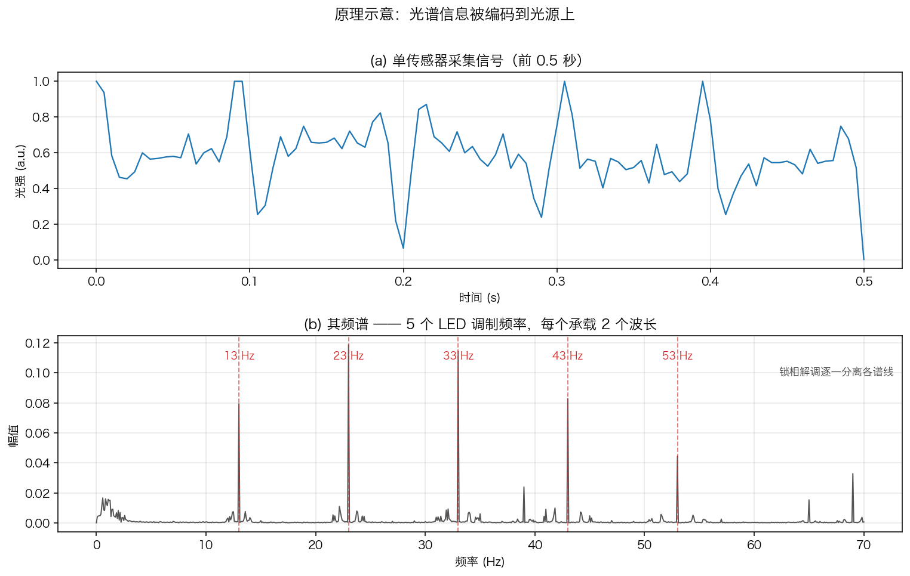
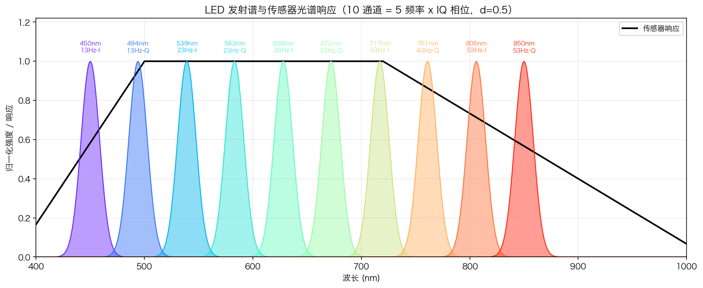
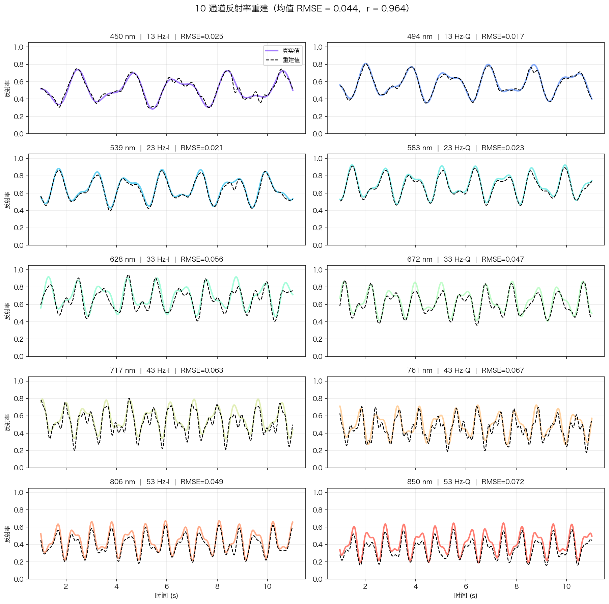
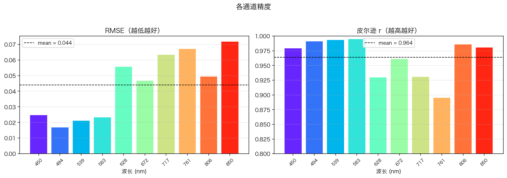

<!-- Language: [English](README.md) | **中文** -->

# 多波长 LED 相位编码光强采集与多光谱重建系统

> **语言**: [English](README.md) | **中文**

**版本**: v1  **日期**: 2026-06-05
**研究状态**: 第一阶段研究完成（单点原理验证），参数已验证

---

## 系统概述

使用多个单波长 LED（PWM 调制）作为光源，通过单像素光强传感器采集目标物体的反射光信号，
利用 **IQ 正交相位锁相检测** 从叠加信号中分离各波长的时变反射率。换言之，**通过对光源进行编码，
让一个普通的单像素/面阵传感器具备多光谱采集能力，成像端无需任何分光元件**。

当前为单点（单像素）原理验证；通过并行化可扩展到面阵，从而实现多光谱视频重建。

### 核心创新

- **相位编码（IQ 调制）**：同一 LED 频率承载 2 个正交通道（I=sin，Q=cos），5 个频率实现 10 路波长
- **d=0.5 消除偶次谐波**：完全正交编码矩阵（条件数=1.0），最小化通道间串扰
- **传感器积分时延补偿**：修正高频 LED 因积分导致的相位偏移（关键，否则高频通道完全失效）

---

## 工作原理 —— 三步看懂数学思路

完整理论（定义、引理、定理及证明）见 [`docs/mathematical_theory.md`](docs/mathematical_theory.md)。直观理解如下：

**第 1 步：编码。** 每个 LED *k* 以各自的频率 $f_k$、50% 占空比方波闪烁。50% 占空比方波的基频很"干净"（偶次谐波全部消失）：

$$p_k(t) = \tfrac12 + \tfrac{2}{\pi}\sin(2\pi f_k t + \varphi_k) + \text{(奇次谐波)}.$$

单个传感器看到的是所有波长贡献之**和**，各项被（时变）反射率 $R_k(t)$ 加权：

$$s(t) = \sum_k w_k\, R_k(t)\, p_k(t) + \text{噪声}.$$

**第 2 步：分离（锁相）。** 把采集信号乘以某个 LED 频率的参考信号，再低通滤波。由于不同频率的正弦相互正交，**其他所有通道平均为零**，只剩该通道缓慢变化的反射率：

$$\mathrm{LPF}\big[\,s(t)\,\sin(2\pi f_k t + \varphi_k)\,\big] = \frac{w_k}{\pi} R_k(t).$$

两个**相同频率**但相差 90°（sin 与 cos）的 LED 同样正交 —— 这就是把通道数翻倍的 **IQ 技巧**。

**第 3 步：标定。** 除以常数即还原反射率 —— 既可用已知权重，也可（无需传感器/LED 信息）除以一帧平整参考板的采集：

$$\hat R_k(t) = \frac{\pi}{w_k}\,\mathrm{LPF}[\,s\, r_k\,]
\qquad\text{或}\qquad
\hat R_k(t) = R_\text{ref}\,\frac{\mathrm{LPF}[\,s\, r_k\,]}{\mathrm{LPF}[\,s_\text{ref}\, r_k\,]}.$$

光谱信息被实实在在地**写入光的频率**中，再由解调器读出 —— 表现为采集信号频谱中的 5 条尖锐谱线：



---

## 最优参数配置

| 参数 | 值 | 说明 |
|------|---|------|
| 传感器采样率 Fs | **200 Hz** | 200Hz 与 500Hz 性能几乎相同，降低硬件需求 |
| ADC 位深 | **8-bit** | 量化噪声不是瓶颈（SNR=42dB 时电子噪声主导） |
| 信噪比 SNR | **≥42 dB** | 测试条件，实际更高更好 |
| LED 频率 | **[13, 23, 33, 43, 53] Hz** | 10Hz 间距为最优（实验扫描验证） |
| LED 占空比 | **50% (d=0.5)** | 消除偶次谐波，正交矩阵条件数=1.0 |
| 通道编码 | **I通道: φ=0°，Q通道: φ=90°** | 各频率组内两路 LED 相差 T/4 |
| LPF 截止频率 | **3.5 Hz** | 可追踪 ≤3.5Hz 的目标反射率变化 |
| LPF 类型 | **4阶 Butterworth（双向）** | 零相位失真 |

### 10 通道波长配置

| 频率 | I 通道 | Q 通道 |
|------|--------|--------|
| 13 Hz | 450 nm | 494 nm |
| 23 Hz | 539 nm | 583 nm |
| 33 Hz | 628 nm | 672 nm |
| 43 Hz | 717 nm | 761 nm |
| 53 Hz | 806 nm | 850 nm |



---

## 重建性能（Fs=200Hz, 8bit, SNR=42dB）

各通道重建反射率均紧密跟踪真实值：





| 通道 | 信号变化频率 | RMSE | 皮尔逊 r |
|------|-----------|------|---------|
| 450nm | 0.50+0.85 Hz | 0.025 | 0.979 |
| 494nm | 0.61+1.04 Hz | 0.017 | 0.991 |
| 539nm | 0.72+1.23 Hz | 0.021 | 0.993 |
| 583nm | 0.83+1.42 Hz | 0.023 | 0.995 |
| 628nm | 0.95+1.61 Hz | 0.056 | 0.930 |
| 672nm | 1.06+1.79 Hz | 0.047 | 0.961 |
| 717nm | 1.17+1.98 Hz | 0.063 | 0.931 |
| 761nm | 1.28+2.17 Hz | 0.067 | 0.895 |
| 806nm | 1.39+2.36 Hz | 0.049 | 0.986 |
| 850nm | 1.50+2.55 Hz | 0.072 | 0.981 |
| **均值** | | **0.044** | **0.964** |

与原始方案（Fs=500Hz, 12bit, STFT, 5通道）相比：均值 RMSE 从 0.056 降至 **0.044**（提升 21%），同时通道数从 5 增加到 **10**。

---

## 目录结构

```
.
├── README.md / README.zh-CN.md      ← 项目说明（中英双语）
├── LICENSE                          ← MIT 许可证
├── CODE_STYLE.md                    ← 代码规范
├── config/                          ← 共享配置（Python 与 C++ 共用）
│   ├── default_10ch.json            ← 已验证 10 通道配置（权重模式）
│   └── example_config.yaml          ← 传感器 + LED 配置模板（带注释）
├── docs/
│   ├── system_documentation.md      ← 系统工程文档（含推导）
│   └── mathematical_theory.md       ← 完整数学理论（引理、定理及证明）
├── figures/                         ← 结果图（中 / 英）
├── python/                          ← Python 实现
│   ├── requirements.txt
│   ├── iq_sensing_system.py         ← 前向仿真器 + 参考演示（含主程序）
│   ├── spectral_reconstruction.py   ← 核心：配置驱动的重建 API
│   ├── make_figures.py              ← 重新生成中英双语 README 结果图
│   ├── examples/example_usage.py    ← 最小可运行示例
│   └── tests/test_reconstruction.py ← 端到端等价性测试
└── cpp/                             ← 重建核心的 C++ 移植
    ├── include/chromacode.hpp       ← 头文件库（基于 Armadillo）
    ├── src/demo.cpp                 ← 演示 / 验证（均值 RMSE 0.0439）
    ├── data/sample_signal.csv       ← 示例采集信号
    ├── CMakeLists.txt
    └── README.md
```

---

## 快速运行

```bash
# 安装依赖
pip install -r python/requirements.txt

python python/iq_sensing_system.py            # 参考仿真 + 可视化
python python/examples/example_usage.py       # 配置驱动 API 的演示
python python/tests/test_reconstruction.py    # 端到端等价性测试
```

## 可复用重建 API

[`python/spectral_reconstruction.py`](python/spectral_reconstruction.py) 提供配置驱动接口：在
JSON/YAML 文件中描述**传感器 + LED**，传入采集到的一维信号，得到各波长反射率。

```python
from spectral_reconstruction import SpectralReconstructor

rec = SpectralReconstructor.from_config_file("config/example_config.yaml")
result = rec.reconstruct(signal, white_reference=gray_capture, reference_level=0.5)
refl_850nm = result.reflectance[850.0]     # 850 nm 通道的时间序列
```

重建核心的 **C++ 移植**见 [`cpp/`](cpp/)（头文件库，基于 Armadillo），逐通道复现 Python 精度，
详见 [`cpp/README.md`](cpp/README.md)。**Python 与 C++ 读同一份 JSON 配置**
（[`config/default_10ch.json`](config/default_10ch.json)），系统参数单一来源。

**传感器光谱响应为可选项**（实际中通常未知）。标定模式按实用性排序：`white_reference`
（拍一帧平整参考板 → 绝对反射率，无需知道 LED 功率与响应）→ `weights`（已标定权重）→
`spectral`（用可选的响应曲线 → 相对反射率）→ `none`（相对量，逐通道尺度未知）。
LED 光谱与响应曲线**波长采样间隔不一致时会自动重采样到统一栅格**。配置模板见
[`config/example_config.yaml`](config/example_config.yaml)。完整数学理论见
[`docs/mathematical_theory.md`](docs/mathematical_theory.md)。

---

## 关键算法：传感器积分时延补偿

这是本方案与朴素 IQ 解调的关键区别。传感器以 Fs=200Hz 采样，每个采样点对 OVERFS/Fs=25 个高采样率点取均值，等效于一个矩形积分器，引入时延：

```
τ = (n_per - 1) / (2 × OVERFS) = 12/5000 = 2.4 ms
```

对于 53Hz LED：相位误差 = 2π×53×0.0024 = 0.80 rad = **45.6°**，若不补偿，幅值只剩 cos(45.6°)=70%。

补偿方法：将参考信号时延 τ：

```python
ref_I = np.sin(2π × f × (t + τ))   # 补偿后的 I 参考
ref_Q = np.cos(2π × f × (t + τ))   # 补偿后的 Q 参考
```

更完整的数学推导见 [`docs/system_documentation.md`](docs/system_documentation.md)。

---

## 引用

如果本工作对你的研究或项目有帮助，欢迎引用：

```bibtex
@misc{chen2026iqspectral,
  author = {Wei Chen},
  title  = {Multi-Wavelength LED IQ Phase-Encoded Reflectance Sensing System},
  year   = {2026},
  note   = {Open-source, MIT License}
}
```

## 许可证

本项目以 [MIT License](LICENSE) 开源，可自由用于学术与工程用途。
作者希望本工作能为多光谱成像与内窥镜领域的研究者提供一个简单、低成本、可复现的参考方案。欢迎贡献与交流。
